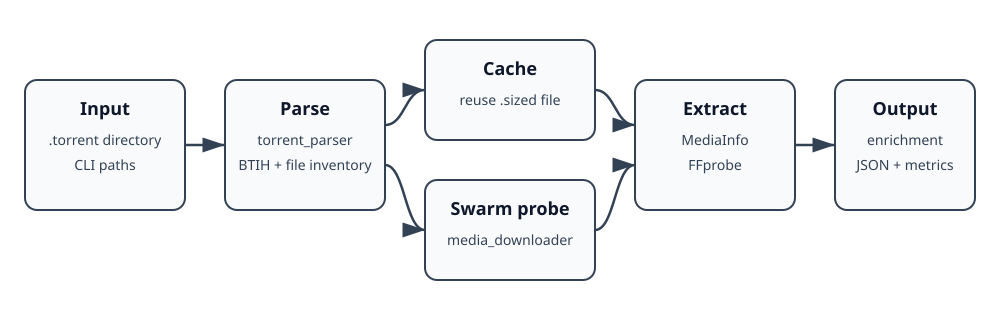

# Alpha60 Swarm Media Probe — Code Guide

This documentation explains the corrected `snake_case` C++ source in `src/`.

## What the program does

The program accepts a directory of `.torrent` files and produces one enriched JSON report for the collection. For each torrent it:

1. parses the torrent and computes its BitTorrent info hash;
2. reuses an existing partial-media cache entry when possible;
3. otherwise asks libtorrent to download only enough of a selected media file for inspection;
4. runs MediaInfo and FFprobe against the cached sample;
5. converts tool output into typed C++ metadata structures; and
6. builds a collection-level JSON document with per-object metadata and pipeline metrics.

The program is deliberately a **probe**, not a complete torrent client. Its output is based on fractional `.sized` media files stored beneath a BTIH-keyed cache directory.

## Documents

- [Architecture](architecture.md) — modules, dependencies, and control flow.
- [Pipeline walkthrough](pipeline_walkthrough.md) — startup through output, including cache and failure paths.
- [Components](components.md) — classes, structs, and important free functions.
- [Data model and JSON](data_model.md) — internal metadata structures and serialization boundaries.

## Source map

| Source file | Primary responsibility |
|---|---|
| `main.cpp` | CLI, orchestration, cache decisions, summaries, interruption handling |
| `torrent_parser.*` | `.torrent` discovery, decoding, BTIH computation, file inventory |
| `torrent_downloader.*` | libtorrent session setup, selective download, disk verification, alerts |
| `mediainfo_extractor.*` | MediaInfo/FFprobe execution and RapidJSON parsing |
| `json_enricher.*` | metrics calculation and final JSON construction |

## Naming convention

Project-defined classes, structs, functions, variables, and members use `snake_case`. Existing JSON keys remain unchanged because they form an external data contract.
