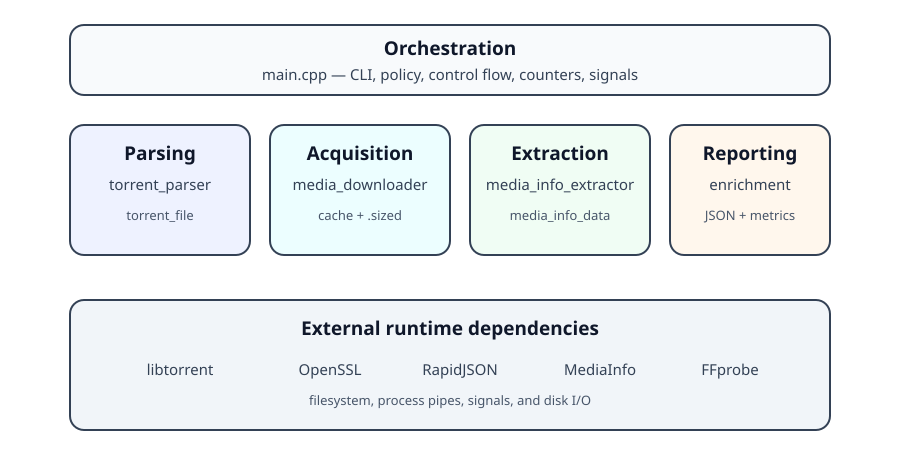

# Architecture

## Layered view



The program is a compact pipeline. `main.cpp` owns the collection lifecycle and coordinates five production source-level modules.

### 1. Input and torrent model

`torrent_parser` scans the input directory for `.torrent` files. Each valid file becomes a `torrent_file` containing:

- the BTIH as a 40-character hexadecimal SHA-1 value;
- the torrent display name;
- paths and sizes of files described by the torrent;
- the aggregate payload size; and
- the local path of the `.torrent` file.

The parser uses libtorrent to decode torrent metadata, but computes the BTIH itself by bencoding the `info` dictionary and hashing those exact bytes with OpenSSL SHA-1.

### 2. Acquisition and cache

`media_downloader` wraps the libtorrent session used for probing. The surrounding orchestration creates a cache directory per torrent:

```text
<cache_dir>/<btih>/.../<media-name>.sized
```

Before contacting the swarm, `find_cache_file()` searches that directory recursively for a `.sized` artifact that meets the configured minimum size.

For a cache miss, `media_downloader::almost_nothing()` selects the largest torrent file but initially assigns every file priority zero. It builds container-aware byte-range plans and maps those ranges to torrent pieces:

- a growing contiguous prefix for all supported media;
- an additional tail of up to 32 MiB for MP4, M4V, and MOV when the download budget permits.

Only those piece spans receive high priority. Completion is determined from `torrent_handle::have_piece()` for every piece intersecting the requested ranges, rather than from aggregate downloaded-byte counters.

The libtorrent backing media remains a sparse file with the original logical size. It is temporary and is normally removed after a cache artifact is committed.

### 3. Redux artifact creation

`media_redux` runs while the sparse backing file still exists. It invokes FFmpeg with:

- explicit demux/mux expectations derived from the source extension;
- one optional video stream, audio streams, and optionally subtitle streams;
- stream copy rather than transcoding;
- tolerant timestamp and damaged-packet flags;
- an explicit output muxer;
- a target output limit; and
- `+faststart` for MP4 and MOV.

The helper writes to an extension-preserving temporary path, validates the result with FFprobe, checks minimum and maximum sizes, then atomically renames it to the `.sized` destination.

If redux fails but the minimum contiguous prefix is verified, the downloader copies that prefix as a fallback. An arbitrary sparse prefix is no longer accepted merely because aggregate progress reached a byte count.

### 4. Metadata extraction

`media_info_extractor` executes two external programs:

- **MediaInfo** supplies broad container, editorial, video, audio, and subtitle metadata.
- **FFprobe** supplements or validates stream-level technical fields.

Both commands return JSON. RapidJSON parses that output into `media_info_data`, whose nested members are `video_metadata`, `audio_metadata`, and `subtitle_metadata`.

### 5. Enrichment and reporting

`enrichment` combines the aligned result arrays in `process_result` with the original torrent inventory. It computes aggregate `pipeline_metrics`, serializes collection and object data, and writes the final JSON file.

## Dependency direction

```text
main.cpp
 ├── torrent_parser
 ├── media_downloader
 │    └── media_redux
 ├── media_info_extractor
 └── enrichment
      ├── torrent_file
      └── media_info_data
```

The leaf modules do not call back into `main.cpp`. Communication is primarily through value objects and `std::optional` results.

The standalone `media_cache_survey.cpp` is separate from the production executable. It independently scans existing cache artifacts and uses its own timeout-capable process runner.

## Architectural characteristics

**Strengths**

- Responsibilities are separated by source file.
- Torrent, acquisition, redux, extraction, and report models are explicit.
- Cache reuse is a first-class path rather than an afterthought.
- Piece verification makes the acquisition contract stronger than aggregate progress.
- The original sparse file is retained until redux or fallback creation completes.
- Failed redux output never replaces a known destination.
- Failures are represented without aborting the whole collection.
- External JSON keys are isolated in the enrichment layer.

**Important coupling**

- `process_result.media_data_list` and `process_result.downloaded_files` are index-aligned.
- The downloader is coupled to libtorrent 2.x piece mapping, priorities, sparse storage, and alert ordering.
- `media_redux` depends on FFmpeg and FFprobe executables being present.
- The extractor depends on MediaInfo and FFprobe.
- `main.cpp` currently owns probe-size policy as compile-time constants.
- Redux success depends on the requested piece ranges containing enough container structure and packet data for the input demuxer.
