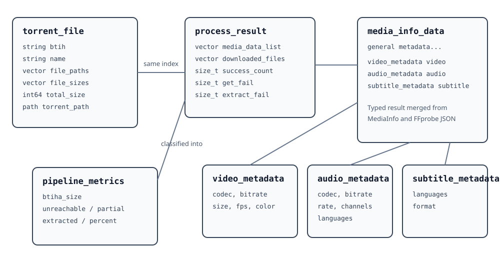

# Data Model and JSON Boundary



## Torrent-side model

`torrent_file` is the durable description of one torrent input:

| Field | Meaning |
|---|---|
| `btih` | SHA-1 info hash in hexadecimal form |
| `name` | Torrent display name |
| `file_paths` | Payload paths inside the torrent |
| `file_sizes` | Byte sizes corresponding to `file_paths` |
| `total_size` | Aggregate payload bytes |
| `torrent_path` | Local path to the source `.torrent` file |

The parallel `file_paths` and `file_sizes` vectors must remain index-aligned.

## Media metadata model

`media_info_data` contains general descriptive fields plus three nested track models.

### `video_metadata`

Codec ID/version, color space, bitrate, dimensions, frame rate, and color primaries.

### `audio_metadata`

Codec/version, bitrate, sampling rate, channel description, bit depth, and a list of languages.

### `subtitle_metadata`

Subtitle languages and format.

### General fields

The general portion includes source, network, format, size, duration, bitrate, domain, collection, season, distributor, genre, content type, owner, country, comment, language, and creation metadata.

## Result alignment

For each torrent index `i`:

```text
torrents[i]
process_result.downloaded_files[i]
process_result.media_data_list[i]
```

refer to the same logical object. When acquisition or extraction fails, the code appends placeholders to preserve this relationship.

## JSON contract

C++ symbols use `snake_case`, but JSON keys are intentionally not derived mechanically from those names. `enrichment::build_output()` writes the external schema explicitly.

That boundary has two consequences:

1. C++ naming refactors do not silently break downstream JSON consumers.
2. Any JSON schema change must be reviewed as an API/versioning decision, not a style cleanup.

## Metric classification

`compute_pipeline_metrics()` inspects each cached path and metadata record:

- **unreachable** — no file or a zero-byte file;
- **partial** — bytes exist but usable video/audio metadata was not confirmed;
- **extracted** — basic video or audio metadata was successfully identified.

The extraction percentage is computed from these collection-level counts and included in the report.
