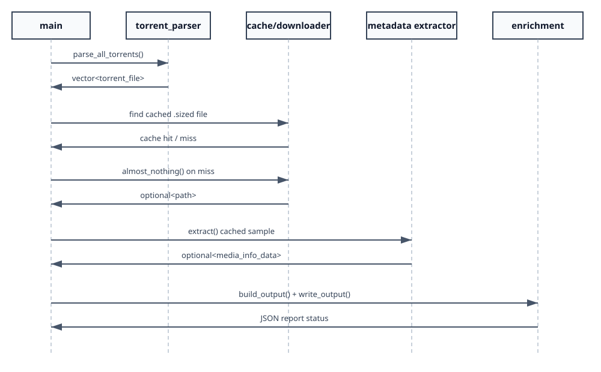
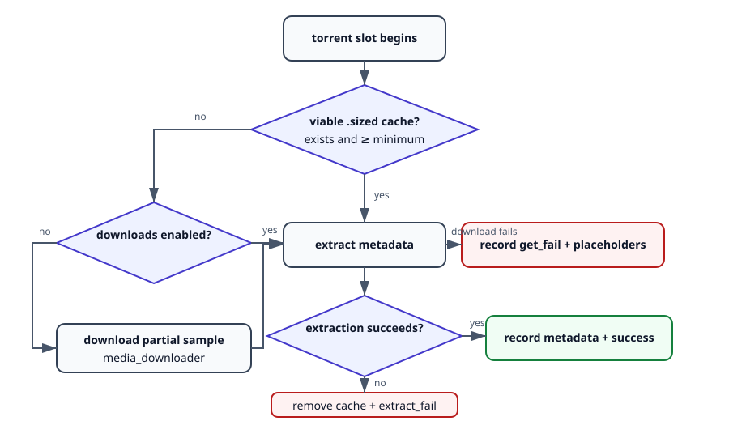

# Pipeline Walkthrough



## Startup

`main()` installs handlers for `SIGINT` and `SIGTERM`. The handler sets the atomic `g_interrupted` flag, allowing the collection loop to stop between torrents.

The CLI accepts:

```text
program <torrent_directory> [output_file] [cache_dir]
```

Defaults are:

- output: `media_objects_medium_info.json`
- cache: `download.cache`

The program validates the input directory and creates missing output and cache directories.

## Step 1: parse torrents

`parse_torrents()` constructs `torrent_parser` and calls `parse_all_torrents()`. For each `.torrent` file:

1. `parse_single_torrent()` opens it through `libtorrent::torrent_info`.
2. `read_torrent_file()` loads the original bencoded bytes.
3. `compute_info_hash()` extracts and re-bencodes `info`, then calculates SHA-1.
4. The parser records every payload file path and size.

Invalid torrents return `std::nullopt` and are omitted from the result vector.

## Step 2: process each torrent

`process_all_torrents()` preserves one output slot per input torrent.



### Cache hit

`find_cache_file()` locates a regular `.sized` artifact. When its size is at least `min_fsize`, the pipeline skips the network and proceeds directly to extraction.

### Cache miss with downloads disabled

The pipeline appends an empty `media_info_data`, appends an empty download path, increments `get_fail`, and continues.

### Cache miss with downloads enabled

`download_torrent_media()` creates the BTIH cache directory, constructs `media_downloader`, and calls `almost_nothing()` using the configured minimum and maximum sizes.

The current policy is:

```text
minimum viable artifact: 16 MiB
maximum selected range budget: 512 MiB
MP4/M4V/MOV tail request: up to 32 MiB
redux target: 112 MiB
redux hard maximum: 128 MiB
```

## Step 3: plan verified torrent ranges

The downloader selects the largest torrent file. All torrent file priorities begin at zero.

For each attempt it grows the prefix target exponentially:

```text
16, 32, 64, 128, 256, 512 MiB
```

The requested prefix and optional ISO base-media tail are converted to torrent piece spans with `file_storage::map_file()`. Only those pieces receive priority 7.

The torrent is paused and flushed after an acquisition attempt. The plan is considered complete only when every required piece reports true through `torrent_handle::have_piece()`.

This distinction matters because aggregate `file_progress()` can include pieces scattered throughout a sparse file; it does not prove that the first N bytes form a complete prefix.

## Step 4: create the cache artifact

When the planned ranges are complete and the sparse source contains nonzero data, `create_media_redux()` runs before the torrent backing file is removed.

Redux:

1. chooses an explicit output muxer from the source extension;
2. writes to an extension-preserving temporary file;
3. stream-copies the first video stream, audio streams, and initially subtitle streams;
4. limits output toward 112 MiB;
5. retries without subtitles when needed;
6. validates the temporary output with FFprobe;
7. enforces the 16–128 MiB output bounds; and
8. renames the temporary output to the `.sized` destination.

If redux fails, acquisition may continue with a larger verified prefix. When the download budget is exhausted, a verified prefix of at least the configured minimum can be copied as a fallback. No fallback is written when the contiguous prefix is unverified.

The temporary sparse media file is removed after artifact creation when deletion is enabled.

## Step 5: metadata extraction

`extract_media_info()` constructs `media_info_extractor` for the cache path and calls `extract()`. The extractor:

1. executes MediaInfo in JSON mode;
2. parses general and track metadata;
3. executes FFprobe in JSON mode;
4. merges useful stream fields; and
5. returns `std::optional<media_info_data>`.

On extraction failure, orchestration removes the bad cache path, appends an empty metadata record, and increments `extract_fail`. This prevents a corrupt cache entry from being reused indefinitely.

## Step 6: build and write JSON

`write_enriched_output()` creates `enrichment`, then calls `build_output()` with the torrent inventory, aligned process results, collection key, cache sample size, total cache size, and total torrent payload size.

`compute_pipeline_metrics()` classifies each torrent/cache slot as unreachable, partial, or extracted. The final JSON string is passed to `write_output()`.

## Completion and interruption

A normal run prints totals for:

- torrents discovered;
- successful extractions;
- acquisition failures; and
- extraction failures.

If interrupted, the loop stops and `main()` exits with status `130` before writing a potentially misleading final report.
